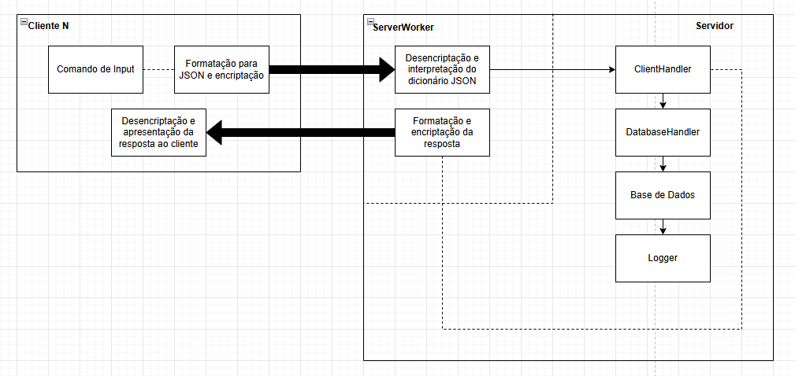
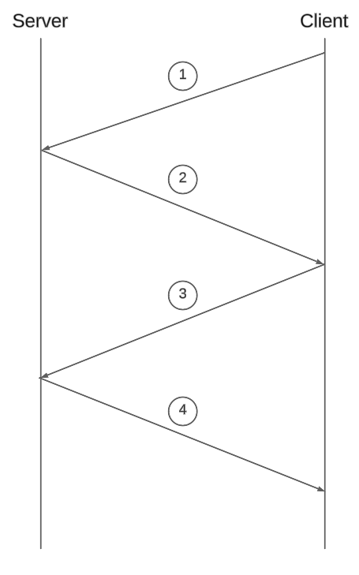
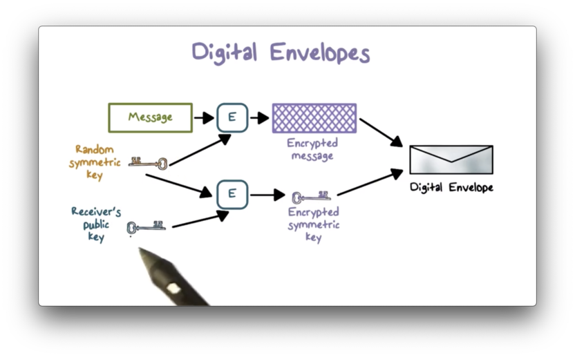

# Projeto de Segurança de Sistemas Informáticos 2024/2025

## Introdução
No contexto da disciplina de Segurança de Sistemas Informáticos, foi-nos proposto o desenvolvimento de um projeto que comporte um serviço de Cofre Seguro, isto é, que permita aos utilizadores o usufruto de um armazenamento pessoal de ficheiros com autenticidade, integridade e confidencialidade, para além de abranger ainda o mesmo serviço de forma coletiva, através da formação e gestão de grupos, aos quais os utilizadores poderão ser associados.

Tabalho realizado pelo grupo G04:
- Diogo Cunha (A100481)
- Carlos Fernandes (A100890)
- João Valente (A100540)

## Bibliotecas Utilizadas
O sistema foi implementado na linguagem **Python**, fazendo uso de diversas bibliotecas e tecnologias de segurança, incluindo:
- **cryptography**: Criptografia de mensagens e manipulação de chaves.
- **base64**: Codificação de conteúdos binários (ficheiros, chaves) em strings para transporte em JSON.
- **x509**: Manipulação de certificados digitais.
- **json**: Formatação de mensagens, e gestão da base de dados em formato Json.
- **logging**: Criação e gestão do sistema de logs.
- **datetime**: Registo de timestamps.
- **asyncio**: Gestão de múltiplas conexões de forma assíncrona.
- **os**: Gestão do sistema de ficheiros local.

## Arquitetura
Para melhor demonstrar a arquitetura do sistema e o processo de troca de mensagens para execução de comandos decidimos desenvolver um diagrama:

Passando agora a uma breve explicação do conteúdo e funcionalidades de cada módulo implementado no projeto.

### Server.py
Módulo que constitui o núcleo do sistema, é responsável por estabelecer conexões TCP seguras através da validação de **Certificados Digitais** e encaminhar os pedidos dos clientes para os componentes adequados do sistema. Este módulo pode ser dividido nas seguintes componentes principais:
- **Inicialização do Servidor**: É iniciada uma *socket* TCP para que seja possivel a conexão com eventuais clientes.
- **Loop Principal de Execução**: O servidor entra num estado de ciclo contínuo onde aceita conexões com clientes e as processa individualmente.
- **Processamento de Pedidos**: Cada mensagem é interpretada como um JSON, e o campo "action" define a operação a executar (por exemplo, `add`, `get`, `share`, `revoke`, etc.). Cada ação é encaminhada para uma função específica que implementa a lógica correspondente.
- **Gestão de Ficheiros e Permissões**: O servidor encaminha a gestão do sistema de ficheiros e permissões para a componente responsável (`DatabaseHandler`).
- **Respostas ao Cliente**: Após o processamento de cada pedido, o servidor envia uma resposta codificada para o cliente correspondente, contendo os resultados da operação (ou mensagens de erro, quando aplicável).

#### **DataStruct.py**
Esboço para melhor visualização da formatação e estrutura dos dados na **_DataBase_**. Contém as estruturas `user`, `group` e `file`.

#### **ClientHandler.py**
Prints de mensagens intermediárias à execução dos comandos, meramente por um motivo de debugging inicial e simples. 

#### **DatabaseHandler.py**
Este módulo é responsável pela gestão da informação no Servidor. Opera sobre dois ficheiros JSON (`group_database.json` e `user_database.json`) que registam os **Users** e os **Grupos** existentes no sistema e sobre o sistema de `VAULTS` (sistema de ficheiros local), onde também existe a separação entre **Grupos** e **Users**. As principais funcionalidades consitem em:
- **Gestão de Utilizadores e Grupos**: Adicionar, remover e gerir utilizadores/grupos
- **Gestão de Ficheiros**: Armazena metadados e conteúdos de ficheiros, garantindo que pertencem ao utilizador/grupo correto.
- **Controlo de Acessos**: Garante que apenas utilizadores autorizados podem aceder, editar ou partilhar ficheiros, feito através da verificação de permissões associadas aos mesmos.
- **Persistência de Dados**: Cada operação de leitura ou escrita carrega o conteúdo para memória, modifica-o, e guarda-o de volta, garantindo que o estado do sistema é sempre atualizado.

#### **IdGenerator.py**
Módulo responsável por gerar **identificadores** únicos e identificáveis através de prefixos padronizados (ex: `FU000000001` para ficheiros de utilizadores, `G00001` para grupos). Este processo é feito guardando o último identificador utilizado para cada categoria e incrementando este valor quando gerado um novo identificador.

#### **Logger.py**
Sistema utilizado pelo servidor para monitorizar o fluxo de mensagens, permitindo registar as mesmas assim como `warnings`, `errors`, `exceptions`, `citical_errors`, e mensagens de `debug`. O sistema de *logs* possui algumas características de segurança:

- Filtra chaves sensíveis (ex: `private_key`, `file_content`, `aes_key`, `etc`.), garantindo que dados críticos não sejam registados nos ficheiros de log;

- Filtra também strings longas ou com formato suspeito (ex: certificados ou ficheiros codificados em base64).

### Client.py
Parte do sistema responsável pela comunicação entre o **Utilizador** físico e o **Servidor**. A sua estrutura está organizada em torno das seguintes funcionalidades principais:
- **Inicialização e Autenticação**: São carregados os dados do certificado do cliente para que a sua identidade seja validada pelo servidor. Também é feita a validação do certificado do servidor para garantir a conexão segura.
- **Interface de Linha de Comandos**: Através do comando de ação e respetivos argumentos(como: `add`, `get`, `update`, etc.), é formatado um pedido para ser enviado ao servidor.

### MessageFormat.py
Padronização do formato das mensagens JSON com as quais é feita a comunicação entre `Server` e `Client`. Possui mecânicas para a geração das mensagens de tráfego **Cliente** => **Servidor** assim com as respostas aos pedidos efetuados, tráfego **Servidor** => **Cliente**.

### ValidaCert.py
Módulo que contém alguns métodos de validação de **Certificados Digitais** assim como formas de os carregar e extrair os seus dados. Assim é garantida a validade das entidades responsáveis pela comunicação.

## Sistemas de Segurança

### Verificação de Certificados
A validação dos certificados é feita durante a fase do *handshake*, com recurso a código disponibilizado pela equipa docente. Para o nosso sistema certificado é considerado válido quando é emitido por uma **Autoridade Certificadora (CA)** confiável, se encontra dentro do **período de validade** e corresponde à **entidade esperada**, prevenindo ataques de *spoofing*. Ambas as partes (Cliente e Servidor), procedem à validação dos certificados de outrem antes de começarem a troca "oficial" de mensagens.

### Troca de Mensagens
A ligação entre o servidor e o cliente é feita através de um canal seguro, garantindo a confidencialidade e integridade das mensagens trocadas. Para atingir esse objetivo, fizemos uso do protocolo Station-to-Station (STS). O protocolo Station-to-Station (STS) é um protocolo criptográfico que permite a duas partes estabelecerem uma chave secreta comum através de Diffie-Hellman e, ao mesmo tempo, garantirem a autenticidade uma da outra através dos supracitados certificados digitais e assinaturas digitais.

#### Handshake
Durante a execução do protocolo, cada parte gera uma chave pública de Diffie-Hellman e assina a chave do outro com a sua própria chave privada, provando a sua identidade e protegendo-se contra ataques do tipo "man-in-the-middle". Essas assinaturas são trocadas juntamente com os certificados para que possam ser verificadas com as chaves públicas contidas nos certificados.

1. O protocolo começa com o cliente a enviar ao servidor a sua chave pública Diffie-Hellman.
2. Em resposta, o servidor envia a sua própria chave pública Diffie-Hellman, também assinada com a sua chave privada, acompanhada do certificado X.509 do servidor. A assinatura cobre tanto a chave pública do servidor como a do cliente, garantindo que a resposta é específica para aquele cliente e protegendo contra ataques de "man-in-the-middle". O cliente, ao receber esta mensagem, valida o certificado do servidor e verifica a assinatura.
3. Depois, o cliente envia uma segunda mensagem ao servidor com a assinatura, feita com a sua chave privada, sobre o par de chaves públicas (a sua e a do servidor). O objetivo é provar ao servidor que o cliente também validou a identidade do servidor, completando assim a autenticação mútua. O cliente envia também o seu certificado, para ser validado pelo servidor.
4. Por fim, o servidor verifica essa assinatura e, se estiver correta, confirma que a troca de chaves e a autenticação foram bem-sucedidas. A partir desse ponto, ambas as partes partilham uma chave simétrica segura, usada para comunicação encriptada, com utilização de AES-GCM, que proporciona tanto confidencialidade, quanto autenticidade para as mensagens, devido ao uso de um código de autenticação de mensagem (MAC) incorporado no processo neste algoritmo de encriptação.

### Armazenamento e Partilha de Ficheiros

Para o armazenamente de ficheiros foram criadas a `user_database` e a `group_database`, para a organização informações sobre utilizadores e grupos, assim como o acesso a ficheiros e permissões associadas. Ambas as bases de dados estão estruturadas no formato JSON, que é amplamente utilizado pela sua simplicidade e flexibilidade na representação de dados.

#### ``user_database``
A ``user_db`` armazena informações sobre os cofres pessoais dos utilizadores e as permissões de acesso a ficheiros. Cada entrada inclui:

- ``vault_path``: O caminho para o cofre do utilizador.

- ``groups``: Grupos aos quais o utilizador pertence e as permissões associadas.

- ``files``: Ficheiros associados ao utilizador, contendo o nome do ficheiro, ID, tamanho e as chaves AES encriptadas para cada utilizador que pode acessá-los.

- ``public_key``: A chave pública do utilizador, usada para autenticação e criptografia.

#### ``group_database``

- ``Identificador do Grupo`` : Cada grupo é identificado por um código único, como "G00001". Este código permite distinguir grupos dentro do sistema.

- ``vault_path``: Representa o caminho para a diretoria onde o cofre do grupo é armazenado.

- ``name``: O nome do grupo, utilizado para referenciar o grupo.

- ``admin``: O administrador do grupo, que tem permissões totais sobre os ficheiros e a gestão do grupo.

- ``members``: Um dicionário que lista os membros do grupo e suas respectivas permissões de acesso aos ficheiros.

- ``files``: Um array de objetos, onde cada objeto representa um ficheiro dentro do cofre do grupo. Cada ficheiro possui os mesmos campos citados para ``user_database``.

A estrutura dos ficheiros na ``user_db`` e na ``group_db`` segue um modelo específico para garantir a segurança e a confidencialidade dos dados, aproveitando o conceito de envelope digital e encriptação assimétrica, que são fundamentais na proteção da informação.

#### Estrutura e Função do Envelope Digital:

Um envelope digital refere-se ao processo de encriptação de uma chave simétrica (como a chave AES) com a chave pública de um destinatário. O ficheiro em si é encriptado com uma chave simétrica (AES). Contudo, a chave AES precisa de ser compartilhada entre as partes autorizadas.
Para garantir a segurança no armazenamento e transmissão dessa chave, a chave simétrica (AES) é encriptada utilizando a chave pública do destinatário. Este processo tem o nome de "envelope digital". O resultado é que a chave AES fica protegida durante a transmissão e só pode ser desencriptada pelo destinatário utilizando a sua chave privada.

Na ``user_db`` e ``group_db``, cada ficheiro possui um campo chamado ``encrypted_aes_key``, que contém a chave AES encriptada para cada utilizador específico. Isso assegura que apenas os utilizadores com a chave privada correspondente possam descriptografar a chave AES e, por conseguinte, aceder ao conteúdo do ficheiro.

#### Estrutura na ``user_db``:
Na ``user_db``, cada utilizador tem uma chave pública única que é usada para encriptar a chave AES dos ficheiros que ele pode aceder. Cada entrada de ficheiro na base de dados contém um campo ``encrypted_aes_key``, onde a chave AES do ficheiro é encriptada usando a chave pública do utilizador.

Isto permite que um utilizador, ao tentar aceder ao ficheiro, utilize a sua chave privada para descriptografar a chave AES, e então use essa chave para aceder ao conteúdo do ficheiro.

#### Estrutura na ``group_db``:
Na ``group_db``, a lógica é similar, mas é aplicada a um conjunto de utilizadores pertencentes a um grupo. O ficheiro pode ser partilhado entre múltiplos utilizadores, e cada um terá a sua própria chave pública utilizada para encriptar a chave AES.

Para cada utilizador do grupo, a chave AES é encriptada individualmente. Isso assegura que apenas os utilizadores com as chaves privadas corretas possam aceder ao conteúdo, mantendo a confidencialidade e a integridade dos dados partilhados.

#### Benefícios e Segurança:
- **Privacidade** : Apenas o utilizador com a chave privada correta pode acessar o conteúdo do ficheiro, mesmo que o ficheiro e a chave AES estejam armazenados em bases de dados acessíveis.

- **Controlo de Acesso**: A encriptação individual da chave AES para cada utilizador, na ``user_db`` e na ``group_db``, assegura que o controlo de acesso aos ficheiros seja granular, permitindo a partilha seletiva e a revogação de permissões de forma eficiente.

Assim, a estrutura das bases de dados reflete um sistema seguro, utilizando conceitos como encriptação assimétrica para proteger a chave simétrica (AES) e garantir que apenas os utilizadores ou grupos autorizados possam aceder aos ficheiros de forma controlada.

## Valorizações Sugeridas

Das valorizações sugeridas pela equipa docente, foram implementadas as seguintes:

- Estruturação as mensagens em JSON 
- Criação de um sistema de logs, tirando partido do próprio JSON para tornar este sistema de logs mais legível e útil.

Não foi implementada a seguinte:

- Geração de certificados nativa. A valorização consistiria em desenvolver uma entidade certificadora interna capaz de gerar pares de chaves, criar pedidos de certificado, assinar esses pedidos com a chave privada da CA existente (VAULT_CA.crt) e produzir certificados X.509 válidos com os campos obrigatórios (PSEUDONYM, CN, OU), que seriam depois guardados em ficheiros PKCS12. Esta funcionalidade permitiria adicionar novos utilizadores ao sistema de forma segura, sem depender de certificados pré-gerados.

## Possíveis Melhorias

Em discussão com o grupo, identificamos a seguintes possíveis valorizações:

- Adicionar uma componente de geração de certificados nativa
- Alguns dos comandos por nós implementados, ao receberem argumentos inválidos, encerram a conexão.
- Implementar o mesmo sistema para diferentes tipos de ficheiros (MP3, MP4, etc...)

## Considerações Finais

Este trabalho prático permitiu-nos a consolidação daquilo que aprendemos tanto nas aulas TP como T desta unidade curricular. Apesar de pontuais difuldades, estamos francamente satisfeitos com o resultado final e acreditamos ter estado à altura da proposta. Acreditamos ter garantido a autenticidade, integridade e confidencialidade de todos os ficheiros e dados manipulados no nosso sistema, que era o grande objetivo deste projeto.

## Bibliografia

Introduction to Cryptography - OMSCS Notes. (n.d.). Www.omscs-Notes.com. https://www.omscs-notes.com/information-security/introduction-to-cryptography/
‌